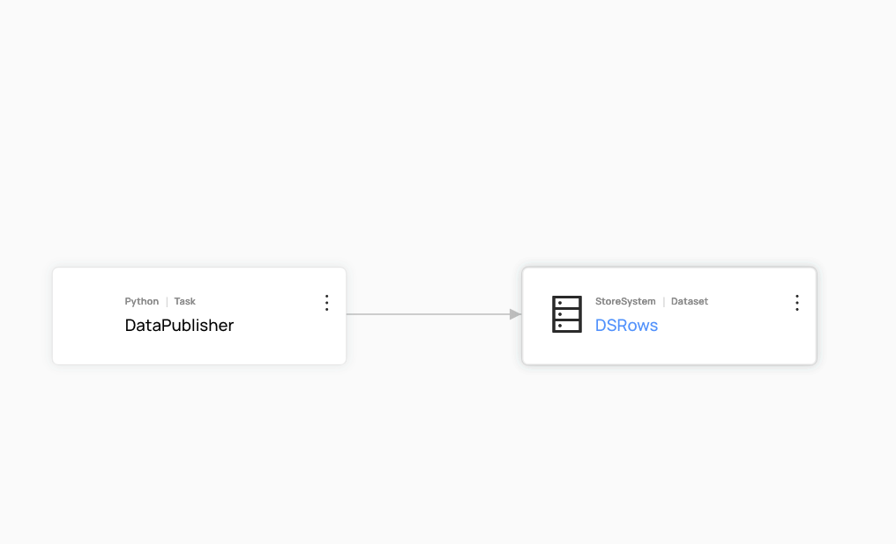

Reproducible:

```bash
datahub docker quickstart --quickstart-compose-file docker/quickstart/docker-compose-without-neo4j-m1.quickstart.yml
tox r -e py
```


Load up then the DS Rows dataset:
http://localhost:9002/dataset/urn:li:dataset:(urn:li:dataPlatform:StoreSystem,DSRows,PROD)/Lineage?is_lineage_mode=true&

I would expect that once clicked 3+ on the degree of dependencies I would see on the lineage tab the tasks from the source
http://localhost:9002/dataset/urn:li:dataset:(urn:li:dataPlatform:Acquisition,Source1.doc.csv,PROD)/Schema?is_lineage_mode=false&schemaFilter=
all the way to the DS rows. Instead just the task that published the data shows up:



Even though the data publisher has a validation parent:

```python
    RunEvent(
        eventTime="2024-06-12T18:00:29.935000+00:00",
        run=Run(
            runId="c7d3c528-bab9-6376-729b-f5ac108ba3d0",
            facets={
                "parent": ParentRunFacet(
                    run=Run(runId="de879cf7-2430-1bd6-f7d9-5f3b527f29e0"),
                    job=Job(namespace="Validation", name="validateData"),
                )
            },
        ),
        job=Job(namespace="CheckFile", name="DataPublisher"),
        eventType=RunState.START,
    )
```
